## Textadept 12.0 alpha Manual

**Contents**

1. [Introduction](#introduction)
2. [Getting Started](#getting-started)
3. [User Interface](#user-interface)
4. [Working with Files and Projects](#working-with-files-and-projects)
5. [Adept Editing](#adept-editing)
6. [Compile, Run, Build, and Test](#compile-run-build-and-test)
7. [Modules](#modules)
8. [Themes](#themes)
9. [Scripting](#scripting)
10. [Compiling](#compiling)
11. [Appendix](#appendix)

---
### Introduction
---

#### Overview

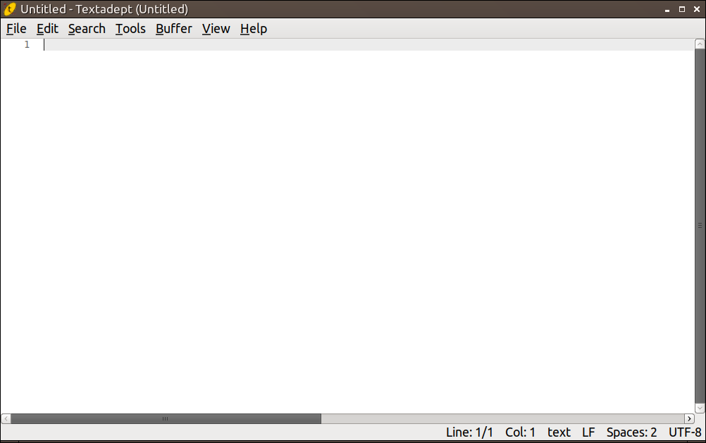

Textadept is a fast, minimalist, and remarkably extensible cross-platform text editor for
programmers. Written in a combination of C, C++, and [Lua][] and relentlessly optimized for speed
and minimalism over the last 15+ years, Textadept is an ideal editor for programmers who desire
endless extensibility without sacrificing speed and disk space, and without succumbing to code
bloat and a superabundance of features. The application has both a graphical user interface
(GUI) version that runs in a desktop environment, and a terminal version that runs within a
terminal emulator.

[Lua]: https://www.lua.org

Textadept is _fast_. It starts up instantly and has a very responsive user interface. C and C++
code is about as fast as you can get, and Lua is widely regarded as being one of the fastest
scripting languages available.

Textadept is minimalist. Not only is this evident in the editor's appearance, but its C and C++
core is limited to around 2000 lines of code and its Lua extension code tries to avoid going
beyond 4000 lines. After more than 15 years of development, Textadept contains [roughly the
same amount of code][] since its inception while significantly improving year after year.

[roughly the same amount of code]: index.html#plots

Textadept is remarkably extensible. It was designed to be that way from the beginning; the editor's
features came later. Most of Textadept's internals are written in Lua: syntax highlighting,
opening and saving files, and search and replace, to name a few. Textadept gives you nearly
complete control over the entire application using Lua. Capabilities like navigating within the
editor, changing menus and key bindings on the fly, handling core events, and highlighting the
syntax of new programming languages are possible. The editor's potential appears limitless.

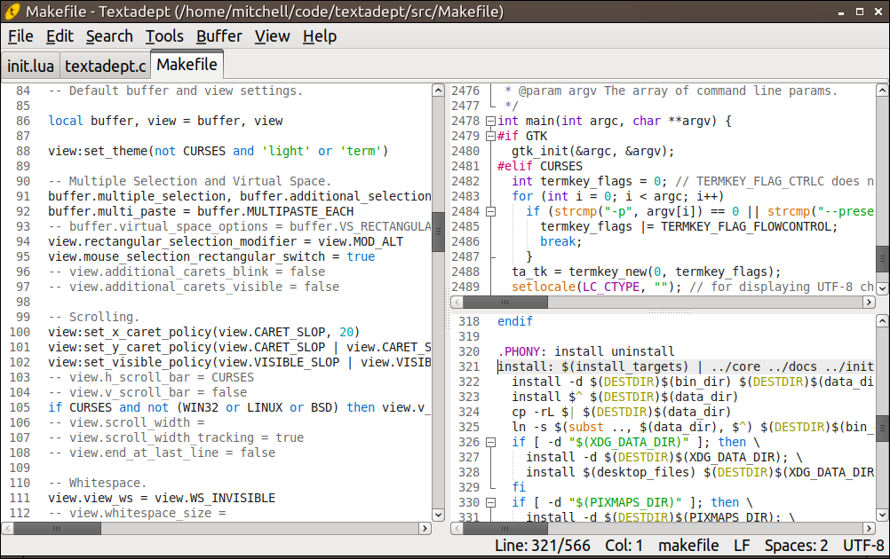

#### About This Manual

This manual uses the following typographical conventions:

* *Italic*: Used for filenames.
* `Constant width`: Used for environment variables, command line arguments, shell code, key
  bindings, and Lua code, including functions, tables, and variables.

Key bindings use the following modifier key representations:

Modifier | Windows and Linux| macOS | Terminal
-|-|-|-
Control | `Ctrl` | `^` | `^`
Alt | `Alt` | `⌥` | `M-`
Command | N/A | `⌘` | N/A
Shift | `Shift` | `⇧` | `S-`

This manual uses the following terminology:

* *buffer*: An object that contains editable text. Some other applications call this object a
  document or file.
* *view*: An object that displays a single buffer. Some other applications call this object
  a window.
* *caret*: The visual that represents the text insertion point. It is usually a blinking line.
* *module*: A package of Lua code that provides functionality for Textadept.
* *lexer*: A Lua module that highlights the syntax of source code written in a particular
  programming language. Textadept refers to a programming language by its lexer's name.

Finally, this manual assumes you are familiar enough with the [Lua][] programming language that
you can understand the simple code samples spread throughout the manual's contents. If you would
like to quickly get up to speed, or need a refresher, the excerpt from [Lua Quick Reference][]
may be of help.

[Lua Quick Reference]: https://orbitalquark.github.io/lua-quick-reference

#### ~/.textadept

Textadept stores all settings and user data in a local user directory that varies, depending
on the platform. This directory can also be configured using command line arguments. On
Windows systems, the default user directory is *C:\\Users\\username\\.textadept\\* or
*C:\\Documents and Settings\\username\\.textadept\\*; on macOS, the default user directory is
*/Users/username/.textadept/*; and on Linux, it is */home/username/.textadept/*. (Substitute
*username* for your actual user name.)  From this point forward, the manual will use
*~/.textadept/* in place of any platform-specific user data directory.

There is a special file, *~/.textadept/init.lua*, that Textadept will create for you if it does
not already exist. This file is what you use to configure Textadept, specify your preferences,
and customize what the application does when it starts. For example, you can use this file to set
a color theme, specify default buffer and view settings, change the settings of existing modules,
load custom modules, configure key bindings, extend menus, enhance support for file types and
programming languages, and run arbitrary Lua code. These topics will be covered throughout
the manual. Textadept's comprehensive [Lua API][] lists, among other things, all configurable
settings for buffers, views, and modules. You can open your *~/.textadept/init.lua* file via
the "Edit > Preferences" menu item.

Here is a simple *~/.textadept/init.lua* for illustration:

    -- Adjust the default theme's font and size.
    if not CURSES then
      view:set_theme('light', {font = 'Monospace', size = 12})
    end

    -- Always use tabs for indentation.
    buffer.use_tabs = true
    buffer.tab_width = 4

    -- Always strip trailing spaces on save, automatically highlight the current
    -- word, and use C89-style block comments in C code.
    textadept.editing.strip_trailing_spaces = true
    textadept.editing.highlight_words = textadept.editing.HIGHLIGHT_CURRENT
    textadept.editing.comment_string.ansi_c = '/*|*/'

    -- Create a key binding to the "Edit > Preferences" menu item.
    if not OSX and not CURSES then
      keys['ctrl+,'] = textadept.menu.menubar[_L['Edit']][_L['Preferences']][2]
    end

    -- Load an external module and bind a key to it.
    local ctags = require('ctags')
    keys.f12 = ctags.goto_tag

    -- Recognize .luadoc files as Lua code.
    lexer.detect_extensions.luadoc = 'lua'

    -- Change the run commands for Lua and Python
    textadept.run.run_commands.lua = 'lua5.1 "%f"'
    textadept.run.run_commands.python = 'python3 "%f"'

    -- Always use PEP-8 indentation style for Python files.
    events.connect(events.LEXER_LOADED, function(name)
      if name ~= 'python' then return end
      buffer.use_tabs = false
      buffer.tab_width = 4
    end)

**Note:** *~/.textadept/init.lua* must not call any functions that create buffers and views
(e.g. `ui.print()`, `io.open_file()`, and `buffer.new()`) at file-level scope. Buffers and
views can only be created within functions assigned to keys, associated with menu items, or
connected to events.

[Lua API]: api.html

---
### Getting Started
---

#### Requirements

In its bid for minimalism, Textadept depends on very little to run. On Windows and macOS,
it has no external dependencies. On Linux, the GUI version depends only on [Qt][] or [GTK][]
(cross-platform GUI toolkits), and the terminal version depends only on a wide-character
implementation of curses like [ncurses]. Most Linux systems either already have these
dependencies installed, or they are readily available from a package manager.

Windows 7 (64-bit) and macOS 10.13 (High Sierra) are the minimum required operating systems. Linux
has no defined minimum.

[Qt]: https://www.qt.io
[GTK]: https://gtk.org
[ncurses]: https://invisible-island.net/ncurses/ncurses.html

#### Download

Textadept releases can be found [here][1]. Select the appropriate package for your platform. A
comprehensive list of changes between releases can be found [here][2]. You can also download
a separate set of modules that provide extra features and functionality to the core application.

**Windows Note:** antivirus software may flag the Windows package as containing a virus or
malware. This is a false-positive, likely due to Textadept's terminal version executable,
which is a console application.

The following table lists Textadept's approximate download and installation size for each platform.

Platform | Download Size | Installed Size
-|-|-
Linux | 7 MB | 23 MB
Windows | 25 MB | 62 MB (7 MB without bundled Qt Runtime)
macOS | 14 MB | 35 MB (13 MB without bundled Qt Runtime)

**Note:** the Windows and macOS platform packages each contain two executables: one for the
GUI version of Textadept, and one for the terminal version. The Linux platform package contains
three executables: one for Qt, one for GTK, and one for the terminal.

[1]: https://github.com/orbitalquark/textadept/releases
[2]: changelog.html

#### Installation

Installing Textadept is simple and easy. You do not need administrator privileges. On Windows and
Linux, simply unpack the archive anywhere. On macOS, unpack the archive and move *Textadept.app*
to your user or system *Applications/* directory like any other macOS application. The macOS
archive also contains a *ta* script for launching Textadept from the command line. You can put
this script somewhere in your `$PATH` (e.g. */usr/local/bin/*), but this is completely optional.

If you downloaded Textadept's extra set of modules, you can unpack its contents into Textadept's
directory (thus merging the *modules/* directories) on Windows and Linux. On macOS, it is
recommended to create a *~/.textadept/* directory (if it does not already exist) and unpack
the modules there (thus creating or merging the *modules/* directory).

**Note:** Textadept generally does not auto-load [modules](#modules), so you will need to load
at least some of those extra modules manually. For example, in your *~/.textadept/init.lua*:

    require('ctags')
    require('file_diff')
    require('spellcheck')

#### Updating

Textadept releases typically occur on the first day of the month every 1-2 months. There is no
auto-update process. (Textadept does not connect to the internet; it's just a text editor.) Simply
download the new version and copy its contents into your current installation, overwriting any
existing files and directories.

#### Running

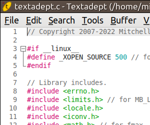
&nbsp;&nbsp;
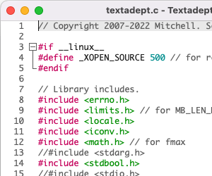
&nbsp;&nbsp;

&nbsp;&nbsp;

Run Textadept on Windows by double-clicking *textadept.exe* or *textadept-curses.exe*. On macOS,
double-click *Textadept.app* or invoke the *ta* script from the command line. On Linux, invoke
*textadept* or *textadept-curses* from a file browser, run dialog, terminal, etc.

For convenience, you can create shortcuts to the executables on the Windows Desktop, Start Menu,
Quick Launch toolbar, etc. On macOS, you can pin the app to your dock. On Linux, you can use
Textadept's *src/textadept.desktop* and *src/textadept-curses.desktop* files: either (1) create
a symbolic link to the executables from somewhere in your `$PATH` (e.g. */usr/local/bin/*)
and then copy those desktop files to a Freedesktop.org-specified applications directory on
your system (e.g. */usr/local/share/applications* or *~/.local/share/applications/*); or (2)
edit those desktop files with the absolute path to the Textadept executables and then copy
those desktop files to an applications directory; or (3) edit those desktop files with the
absolute path to the Textadept executables and then double-click the desktop file you want
to run. By copying Textadept's desktop files to an applications directory on your system,
Textadept will show up in your desktop environment's menu system (GNOME, KDE, XFCE, etc.). You
can properly set Textadept's icon by either copying Textadept's *core/images/textadept.svg*
to a Freedesktop.org-specified "hicolor" theme directory (e.g. */usr/share/icons/scalable/apps*
or *~/.local/share/icons/scalable/apps*), or by editing Textadept's desktop files to set "Icon"
to the absolute path to *core/images/textadept.svg*.

Textadept accepts a variety of command line arguments, which are listed in the table below.

Option | Arguments | Description
-|:-:|-
`-e`, `--execute` | 1 | Run the given Lua code
`-f`, `--force` | 0 | Forces unique instancea
`-h`, `--help` | 0 | Shows thisb
`-l`, `--line` | 1 | Jumps to a line in the previously opened file
`-n`, `--nosession` | 0 | No state saving/restoring functionality
`-p`, `--preserve` | 0 | Preserve ^Q and ^S flow control sequencesc
`-s`, `--session` | 1 | Loads the given session on startup
`-u`, `--userhome` | 1 | Sets alternate user data directory
`-v`, `--version` | 0 | Prints version and copyright infob
`-` | 0 | Read stdin into a new bufferb

aGTK version only. 
bThe terminal version does not support these. 
cNon-Windows terminal version only.

You can add your own command line arguments using [`args.register()`][]. For example, in your
*~/.textadept/init.lua*:

    args.register('-r', '--read-only', 0, function()
      events.connect(events.FILE_OPENED, function()
        buffer.read_only = true -- make all opened buffers read-only
      end)
      textadept.menu.menubar = nil -- hide the menubar
    end, "Read-only mode")

[`args.register()`]: api.html#args.register

Textadept can also open files and projects using the command line. For example:

    textadept /path/to/file1 ../relative/path/to/file2
    textadept /path/to/project/ relative/path/to/file1 relative/file2

Unless a filename is specified as an absolute path, Textadept assumes it is relative to
the application's current working directory (cwd). Textadept's cwd is initially the command
line's cwd. (If Textadept is not being run from the command line, its cwd is unspecified.) If a
project directory is specified, it becomes Textadept's cwd. (Textadept does not open all files
in that directory.)  If multiple project directories are specified, the last one becomes the cwd.

By default, Textadept saves its state when it exits. (This state consists of buffers and split
views that are open, the list of recently opened files, the application window's size and
maximized state, etc.) If Textadept is not given any files or projects to open, it will try to
restore its state at last exit.

**Tip:** you can explicitly tell Textadept to load a session by name using the `-s` or `--session`
command line argument. You can disable session functionality using `-n` or `--nosession`. Session
files are stored in *~/.textadept/*, and the default session name is "session".

**Linux Note:** the GTK version of Textadept is a single-instance application. (The Qt version
is not.) This means that after you start Textadept, any time you invoke it again (e.g. opening a
file from a file browser or command line), the action happens in the original instance. If you
want to run separate instances of Textadept, pass the `-f` or `--force` command line flag. On
Linux, you can set up your button or menu launchers to pass the flag to the *textadept* executable.

Textadept can be run as a portable application. This is useful if, for example, you want to
install Textadept onto a flash drive and take it with you for use on multiple machines. Normally,
all settings and user data is stored in *~/.textadept/* (a local user directory that varies,
depending on the platform). However, this user directory can be controlled using the `-u` or
`--userhome` command line argument. For example, invoking *textadept.exe* with the command line
arguments `-u userdata` will read from and store settings and user data to a *userdata/* directory
located inside an installation of Textadept. You can create a Windows shortcut that passes these
command line arguments to the Textadept executable and use that shortcut to run Textadept portably.

Textadept's user interface has been translated into a few different languages. When the
application starts, it attempts to auto-detect your language settings by reading from the `$LANG`
environment variable. If Textadept cannot determine what language to use, or if it does not
support your language, it falls back on English. You can manually set your locale by copying
one of the locale configuration files from Textadept's *core/locales/* to your *~/.textadept/*
directory and renaming it *locale.conf*. If you would like to translate Textadept into your
language, please translate the English messages in *core/locale.conf* and send me (see README.md)
the modified file for inclusion in a future release.

**macOS Tip:** by default, macOS does not allow GUI applications like *Textadept.app* to see
shell environment variables like `$PATH`. (The terminal version is unaffected.) Consequently,
any features that utilize programs contained in `$PATH` (e.g. the programs in */usr/bin/*
or */usr/local/bin/*) will not find those programs. In order to work around this, Textadept
automatically invokes a user-created *~/.textadept/osx_env.sh* file when the application
starts. This script should export all of the environment variables you need Textadept to
see. For example:

    export PATH=$PATH

**Linux Note:** providing a single binary that runs on all Linux systems proves challenging,
since the versions of software installed vary widely from distribution to distribution. If
Textadept will not start on your machine, you will need to [compile](#compiling) Textadept
manually for your system, which is a very straightforward and easy process.

---
### User Interface
---

Textadept's user interface is sleek and simple. It consists of a menu bar, tab bar, editor
view, and statusbar. There is also a find & replace pane and a command entry, though Textadept
initially hides them both.

Textadept's titlebar shows the name and path of the current, active buffer. A '\*' character,
if present, indicates there are unsaved changes in that buffer.

#### Menu

The GUI version of Textadept has a completely customizable menu that provides access to nearly
all of the application's editing features.

**Tip:** Textadept is largely a keyboard-driven application, so nearly every menu item has
a key binding. For at least the GUI version in the English locale on Windows and Linux, each
menu and menu item also has a unique mnemonic that can be used to activate it. For example,
`Alt+E` accesses the "Edit" menu, `S` opens the "Select" sub-menu, and `L` invokes the menu
item that selects the current line.

Textadept's menu is also accessible in the form of a searchable dialog via `Ctrl+P` on Windows
and Linux, `⌘P` on macOS, and `^P` in the terminal version. (Despite the fact that the
terminal version does not have a menu, it does have this dialog.) Typing part of the name of
any command in the dialog filters the list, with spaces being wildcards. The arrow keys move
the selection up and down. Pressing `Enter`, selecting `OK`, or double-clicking on a command
invokes it. (The terminal version requires pressing `Enter`.) This feature is an alternative
to navigating the menus or remembering key bindings. It can also be used to quickly look up
key bindings for particular commands.

**Note:** for commands that have more than one key binding, only one of those bindings is shown
in the menu and dialog, and that binding is randomly chosen.

You can extend Textadept's menu with your own menus, sub-menus, and menu items by modifying
the [`textadept.menu.menubar`][] table. Any modifications will show up in the selection dialog
mentioned previously, even in the terminal version. For example, in your *~/.textadept/init.lua*:

    local tools = textadept.menu.menubar[_L['Tools']]
    tools[#tools + 1] = {''} -- separator
    tools[#tools + 1] = {'Reset L&ua State', reset}

[`textadept.menu.menubar`]: api.html#textadept.menu.menubar

#### Tab Bar

The GUI version of Textadept has a tab bar that displays all of Textadept's open buffers
by name, though it is only visible when two or more buffers are open. A '\*' character, if
present, indicates there are unsaved changes in the marked buffer. There is only one tab bar
for the entire application, even if there are multiple split views. When two or more views
are open, the state of the tab bar applies only to the active view, and using the tab bar to
switch between files also applies only to that view. Right-clicking on the tab bar brings up
a configurable context menu that is defined by [`textadept.menu.tab_context_menu`][]. Tabs can
be rearranged by clicking, dragging, and dropping them. You can turn off the tab bar by setting
[`ui.tabs`][]. For example, in your *~/.textadept/init.lua*:

    ui.tabs = false

[`textadept.menu.tab_context_menu`]: api.html#textadept.menu.tab_context_menu
[`ui.tabs`]: api.html#ui.tabs

Cycle to the next buffer via `Ctrl+Tab` or `Ctrl+PgDn` on Windows and Linux, `^⇥` or `⌘⇟`on
macOS, and `M-PgDn` in the terminal version. Cycle to the previous buffer via `Ctrl+Shift+Tab`
or `Ctrl+PgUp`, `^⇧⇥` or `⌘⇞`, and `M-PgUp`.

The tab bar is also accessible in the form of a searchable dialog via `Ctrl+B` on Windows and
Linux, `⌘B` on macOS, and `^B` in the terminal version. (Despite the fact that the terminal
version does not have a tab bar, it does have this dialog.) The dialog displays a list of currently
open buffers. Typing part of any filename filters the list, with spaces being wildcards. The arrow
keys move the selection up and down. Pressing `Enter`, selecting `OK`, or double-clicking on a
buffer switches to it. (The terminal requires pressing `Enter`.) This feature is particularly
useful when many files are open, and navigating through the tab bar is tedious.

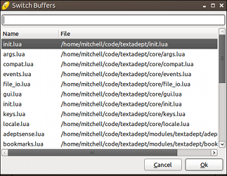
&nbsp;&nbsp;

By default, the list shows more recently used buffers towards the top. You can configure the
list to show buffers in the same order as the tab bar (the most recently opened buffers are
shown towards the bottom) by changing the [`ui.buffer_list_zorder`][]. For example, in your
*~/.textadept/init.lua*:

    ui.buffer_list_zorder = false

[`ui.buffer_list_zorder`]: api.html#ui.buffer_list_zorder

#### Editor View

The editor view is where you will spend most of your time in Textadept. You can split it vertically
and horizontally as many times as you like, and you can view the same buffer in two or more
separate views. Lua also has near complete control over all views. The [`buffer`][] and [`view`][]
documentation lists everything you can do with buffers and views directly. Right-clicking inside
a view brings up a configurable context menu that is defined by [`textadept.menu.context_menu`][].

Split views can be dynamically resized by clicking and dragging on the splitter bar that
separates them. The following key bindings apply for split views:

a* Split a view horizontally into top and bottom views via `Ctrl+Alt+_` on Windows and Linux,
  `^⌘_` on macOS, and `M-_` in the terminal version.
* Split a view vertically into side-by-side views via `Ctrl+Alt+|` on Windows and Linux,
  `^⌘|` on macOS, and `M-|` in the terminal version.
* Cycle to the next split view via `Ctrl+Alt+PgDn` on Windows and Linux, `^⌘⇟` on macOS,
  and `M-^PgDn` in the terminal version.
* Cycle to the previous split view via `Ctrl+Alt+PgUp` on Windows and Linux, `^⌘⇞` on macOS,
  and `M-^PgUp` in the terminal version.
* Grow or shrink a view via `Ctrl+Alt++` or `Ctrl+Alt+-`, respectively, on Windows and Linux;
  `^⌘+` or `^⌘-`, respectively, on macOS; and `M-+` or `M--` in the terminal version.
* Unsplit the current view by removing its complement view(s) via `Ctrl+Alt+W` on Windows and
  Linux, `^⌘W` on macOS, and `M-W` in the terminal version.
* Unsplit the current view by removing all other views via `Ctrl+Alt+Shift+W` on Windows and
  Linux, `^⌘⇧W` on macOS, and `M-S-W` in the terminal version.

**Note:** depending on the split sequence, the order when cycling between views may not be linear.

[`buffer`]: api.html#buffer
[`view`]: api.html#view
[`textadept.menu.context_menu`]: api.html#textadept.menu.context_menu

#### Find & Replace Pane

The find & replace pane is a compact, full-featured pane that allows you to quickly search
through files and directories. The pane is available only when you need it and quickly gets
out of your way when you do not, minimizing distractions.

You can summon the find & replace pane via `Ctrl+F` on Windows and Linux, `⌘F` on macOS,
and `^F` in the terminal version. It has the usual find and replace functionality you would
expect, along with "Match Case", "Whole Word", "[Regex](#regex-and-lua-pattern-syntax)", and
"In Files" options. The pane also stores find and replace history. As you search, Textadept
can automatically highlight all instances of found text in the current buffer by setting
[`ui.find.highlight_all_matches`][]. For example, in your *~/.textadept/init.lua*:

    ui.find.highlight_all_matches = true

**Note:** Textadept does not support multi-line regex searches.

**Terminal version note:** find and replace history is limited to 10 items each.

While the pane is open in the GUI, the following key bindings apply:

* Perform "Find Next" and "Find Prev" in the "Find" entry via `Enter` and `Shift+Enter`,
  respectively.
* Perform "Replace" and "Replace All" in the "Replace" entry via `Enter` and `Shift+Enter`,
  respectively. When the "Regex" find option is enabled,

  + `\`*`n`* in the "Replace" entry represents the *n*th captured matching region's text, and
    `\0` represents all matched text.
  + `\U` and `\L` converts everything up to the next `\L`, `\U`, or `\E` to uppercase and
    lowercase, respectively. (`\E` turns off conversion.)
  + `\u` and `\l` converts the next character to uppercase and lowercase, respectively. These
    may appear within `\U` and `\L` constructs.

* For at least the English locale on Windows and Linux, toggle the find options using their
  button mnemonics: `Alt+M`, `Alt+W`, `Alt+X`, `Alt+I`. macOS does not support mnemonics.
* Cycle through find/replace history via `Up` and `Down` on Windows, Linux, and the terminal
  version, and `⇡` and `⇣` on macOS.
* Hide the pane via `Esc`.

While the pane is open in the terminal version, the following key bindings apply:

* Switch between "Find" and "Replace" entries via `Down` and `Up`.
* Toggle between "Find Next" and "Find Prev" in the "Find" entry via `Tab`.
* Toggle between "Replace" and "Replace All" in the "Replace" entry via `Tab`.
* Perform the highlighted find/replace action via `Enter`.
* Toggle the find options via `F1`, `F2`, `F3`, and `F4`.
* Cycle through find/replace history via `^P` and `^N`.
* Erase the contents of the focused entry via `^U`.
* Hide the pane via `Esc`.

**Tip:** by default, "Replace All" replaces all text in the buffer. Selecting text and then
performing "Replace All" replaces all text in that selection only.

[`ui.find.highlight_all_matches`]: api.html#ui.find.highlight_all_matches

##### Find in Files

Textadept can search for text within multiple files and directories via `Ctrl+Shift+F` on
Windows and Linux, `⌘⇧F` on macOS, and `M-^F` in the terminal version. Invoking "Find Next"
prompts you for a directory to search in. The "Replace" entry has been substituted for a "Filter"
entry that contains files and directories to include or exclude from the search.

A filter consists of a comma-separated list of glob patterns that match filenames and directories
to include or exclude. Patterns are inclusive by default. Exclusive patterns begin with a
'!'. If no inclusive patterns are given, any filename is initially considered. As a convenience,
'/' also matches the Windows directory separator ('[/\\]' is not needed). The default filter
excludes many common binary files and version control directories from searches.

**Tip:** Textadept keeps track of filters set per-directory. You can also set per-directory filters
in Lua by modifying [`ui.find_in_files_filters`][]. For example, in your *~/.textadept/init.lua*:

    -- Only search in certain source directories.
    ui.find.find_in_files_filters['/path/to/project'] = {'/include', '/src'}

After performing a "Find in Files" search, a temporary buffer lists the search results. You can
use the arrow keys to navigate within the list and press `Enter` to go to a result's location
in its respective file. You can also double-click on results or go to the next or previous
result via `Ctrl+Alt+G` or `Ctrl+Alt+Shift+G`, respectively, on Windows and Linux; `^⌘G` or
`^⌘⇧G`, respectively, on macOS; and `M-G` or `M-S-G`, respectively, in the terminal version.

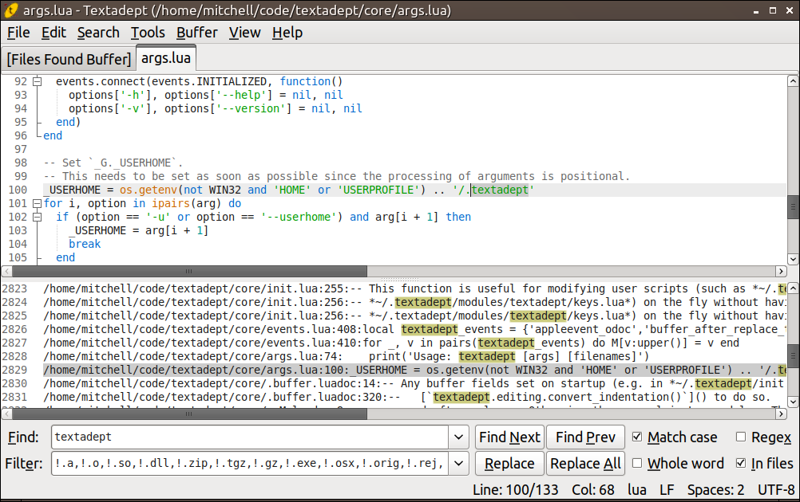

[`ui.find_in_files_filters`]: api.html#ui.find.find_in_files_filters

##### Incremental Find

Textadept searches for text incrementally as you type when you summon the find & replace pane via
`Ctrl+Alt+F` on Windows and Linux, `^⌘F` on macOS, and `M-F` in the terminal version. All of
the find options apply except for "In Files".

#### Command Entry

The versatile command entry has many different roles. Its primary role is to execute Lua commands
and interact with Textadept's internal Lua state. In another context it filters text through
shell commands. [Lua extensions][] allow it to do even more. Like the find & replace pane,
the command entry pops in and out as you wish. Each role has its own history that can be cycled
through via the `Up` and `Down` key bindings on Windows, Linux, and the terminal version, and
`⇡` and `⇣` on macOS.

[Lua extensions]: api.html#ui.command_entry

##### Lua Command Entry

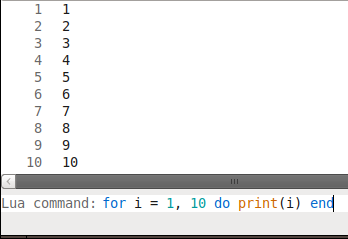

You can open the Lua command entry via `Ctrl+E` on Windows and Linux, `⌘E` on macOS, and `^E`
in the terminal version. It acts very similarly to Lua's interactive prompt. Type in the Lua
command or code to run and press `Enter` to invoke or run it. Textadept's [Lua API][] contains
all of the application's built-in commands. For convenience, the contents of the [`buffer`][],
[`view`][], [`ui`][], and [`textadept`][] tables are considered to be global variables, the
first parameter to `buffer` and `view` functions may be omitted, and function call parentheses
can also be omitted. For example, instead of entering `buffer:append_text('foo')`, you can
enter `append_text('foo')`. Instead of `view:split()`, you can simply use `split`. These
convenience facilities are not available in normally executed Lua code, such as code in
*~/.textadept/init.lua*.

**Warning:** if you try to cause instability of Textadept's Lua state, you will probably succeed,
so be careful.

The following key bindings apply in the Lua command entry:

* Show a documentation popup for the command under or behind the caret via `Ctrl+?` on Windows
  and Linux, `⌘?` or `^?` on macOS, and `M-?` or `^?` in the terminal version.
* Show completion candidates for Lua variables, tables, functions, and fields via `Tab` on
  Windows, Linux, and the terminal version, and `⇥` on macOS. Use the arrow keys to make a
  selection and press `Enter` to insert it.

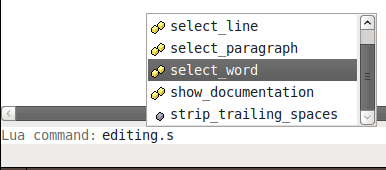

You can specify on the command line Lua commands and code to run on startup using the `-e` and
`--execute` command line argument. This is useful when you want to run dynamic commands that
do not belong in *~/.textadept/init.lua*.

**Tip:** a side-effect of single-instance functionality in the GTK version of Textadept is that
you can remotely control the original instance of Textadept. For example:

    textadept ~/.textadept/init.lua &
    textadept -e "events.emit(events.FIND, 'require')"

This will search for the first instance of the word "require" in the current file.

[Lua API]: api.html
[`buffer`]: api.html#buffer
[`view`]: api.html#view
[`ui`]: api.html#ui
[`textadept`]: api.html#textadept

##### Shell Command Entry and Filtering Text

You can filter text through shell commands via `Ctrl+|` on Windows and Linux, `⌘|` on macOS,
and `^\` or `^|` in the terminal version. An example would be running the shell command `sort`,
which accepts lines in a buffer as standard input (stdin), sorts those lines, and then emits
them to standard output (stdout), which Textadept replaces the original input text with.
[`textadept.editing.filter_through()`][] describes how this feature determines stdin.

**Note:** when using the GTK or terminal versions of Textadept, be careful when using commands
that emit stdout while reading stdin (as opposed to emitting stdout only after stdin is
closed). Input that generates more output than stdout can buffer may hang Textadept. On Linux
for example, stdout may only be able to hold 64K while there is still incoming input. The Qt
version of Textadept does not exhibit this limitation.

[`textadept.editing.filter_through()`]: api.html#textadept.editing.filter_through

#### Statusbar

The statusbar consists of two sections. The left section displays temporary status messages,
while the right section shows buffer status information. Buffer status information includes:

* The current line and column number.
* The lexer language name.
* The line ending mode, or EOL mode, which is either CRLF ("\r\n") or LF ('\n'). Line endings
  are the characters that separate lines.
* The indentation settings, which are a combination of an indentation character (either a tab
  or a space) and an indentation size (a measure of how many space characters are in one level
  of indentation). If tabs are used for indentation, then the indentation size is the number
  of space characters to draw for each tab character.
* The buffer's encoding. File and buffer encoding specifies how to interpret text bytes for
  display.

---
### Working with Files and Projects
---

Textadept allows you to open files using a variety of methods:

* Open, using a standard file chooser dialog, one or more files in a single directory via
  `Ctrl+O` on Windows and Linux, `⌘O` on macOS, and `^O` in the terminal version.
* Open, using a quick open dialog, one or more files in the current project or Textadept's
  current working directory via `Ctrl+Shift+O` on Windows and Linux, `^⌘O` on macOS, and
  `M-^O` in the terminal version. Typing part of any filename filters the list, with spaces
  being wildcards. The arrow keys move the selection up and down. Holding down `Shift` while
  pressing the arrow keys selects multiple files, as does holding down `Ctrl` while clicking.
  Pressing `Enter` or selecting `OK` opens all selected files. Double-clicking on a single file
  opens it. (The terminal requires pressing `Enter`.)
* Open, using a quick open dialog, one or more files in the directory of the currently opened
  file via the "Tools > Quick Open > Quickly Open Current Directory" menu item.
* Open a file by dragging it from a file manager and dropping it into one of Textadept's views.
* Open a recently opened file from a list of recent files via the "File > Open Recent..." menu
  item.
* Open, using a quick open dialog, one or more files in *~/.textadept/* via `Ctrl+Alt+U`
  on Windows and Linux, `⌘⇧U` on macOS, and `M-U` in the terminal version.
* Reopen the currently opened file, discarding any unsaved changes, via the "File > Reload"
  menu item. Textadept will prompt you to reload a file if the editor detects it has been
  modified externally.

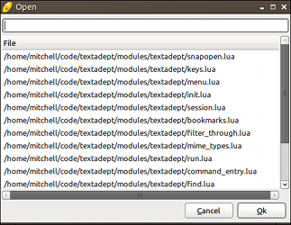

When it comes to projects, Textadept's only concept of a project is a parent directory under
a recognized form of version control (Git, Mercurial, SVN, Bazaar, and Fossil). There is no
"Open Project" action. Textadept can work with multiple projects at once, since the current
project depends largely on context. The current project is determined as follows:

1. If the current buffer is a file, its parent directory is searched for a version control
   directory. If none is found, that directory's parent directory is searched next, and so
   on. If a version control directory is found, its parent directory is the current project.
2. If Textadept's current working directory (cwd) contains a version control directory, that cwd
   is the current project. Otherwise, the cwd's parent directory is searched, just like in step 1.
3. If no version control directory is found, there is no current project.

**Tip:** you can specify Textadept's current working directory by passing it on the command
line when running the application. This effectively starts Textadept with a "default project".

By default, Textadept's quick open dialog displays nearly all types of files, and only the first
1000 files it finds. You can assign a project or directory-specific filter that indicates which
files to display for that project or directory by modifying [`io.quick_open_filters`][], and
you can specify a different maximum file list size that applies to all projects and directories
by setting [`io.quick_open_max`][]. For example, in your *~/.textadept/init.lua*:

    io.quick_open_filters['/path/to/project'] = {'/include', '/src'}
    io.quick_open_max = 10000 -- support huge projects

A filter consists of a comma-separated list of glob patterns that match filenames and directories
to include or exclude. Patterns are inclusive by default. Exclusive patterns begin with a
'!'. If no inclusive patterns are given, any filename is initially considered. As a convenience,
'/' also matches the Windows directory separator ('[/\\]' is not needed). The default filter
excludes many common binary files and version control directories from searches.

You can mimic a more traditional approach to projects by saving and loading project-specific
sessions via the "File > Save Session..." and "File > Load Session..." menu items, respectively. A
session can be loaded on startup using the `-s` or `--session` command line argument.

[`io.quick_open_filters`]: api.html#io.quick_open_filters
[`io.quick_open_max`]: api.html#io.quick_open_max

##### Language

When Textadept opens a file, it automatically attempts to identify the programming language
associated with that file and assigns a lexer to perform syntax highlighting of the file's
contents. The identification process is as follows:

1. The first line of the file is checked against any [Lua patterns](#regex-and-lua-pattern-syntax)
   in [`lexer.detect_patterns`][]. If there is a match, the lexer associated with that matching
   pattern is used.
2. The file's extension is checked against any of the extensions in
   [`lexer.detect_extensions`][]. If there is a match, the lexer associated with that matching
   extension is used. If the file does not have an extension, the entire file name is used in
   the check.

You can associate first line patterns, file extensions, and file names with lexers by
modifying [`lexer.detect_patterns`][] and [`lexer.detect_extensions`][]. For example, in your
*~/.textadept/init.lua*:

    lexer.detect_patterns['^#!.+/zsh'] = 'bash'
    lexer.detect_extensions.luadoc = 'lua'

Textadept has lexers for more than 100 different programming languages and recognizes hundreds
of file types. In the event that your programming language is not understood, you can write a
[lexer][] for it, place that lexer in your *~/.textadept/lexers/* directory, and add an extension
and/or pattern for it.

For a given lexer name, Textadept attempts to find, in order, that lexer from the following
locations:

1. Your *~/.textadept/lexers/* directory.
2. Textadept's *lexers/* directory.

**Tip:** placing lexers in your user data directory avoids the possibility of you overwriting
them when you update Textadept. These lexers also take precedence over the ones installed
with Textadept.

You can manually change a buffer's lexer via `Ctrl+Shift+L` on Windows and Linux, `⌘⇧L` on
macOS, and `M-^L` in the terminal version. Typing part of a lexer name in the dialog filters
the list, with spaces being wildcards. The arrow keys move the selection up and down. Pressing
`Enter`, selecting `OK`, or double-clicking on a lexer assigns it to the current buffer. (The
terminal requires pressing `Enter`.)

[`lexer.detect_patterns`]: api.html#lexer.detect_patterns
[`lexer.detect_extensions`]: api.html#lexer.detect_extensions
[lexer]: api.html#lexer

##### Encoding

Textadept has the ability to work with files encoded in one of many different encodings, but by
default it only attempts to read UTF-8, ASCII, CP1252, and UTF-16 files, in that order. If you work
with files that have other encodings, you will need to add them to [`io.encodings`][], Textadept's
known encoding list, before attempting to open one. For example, in your *~/.textadept/init.lua*:

    io.encodings[#io.encodings + 1] = 'UTF-32'
    table.insert(io.encodings, 3, 'Macintosh') -- before CP1252

You can convert a buffer's encoding using the "Buffer > Encoding" menu or
[`buffer.set_encoding()`][]. You can extend the menu to include more encodings. For example,
in your *~/.textadept/init.lua*:

    local menu = textadept.menu.menubar[_L['Buffer']][_L['Encoding']]
    local encoding = 'UTF-32'
    menu[#menu + 1] = {encoding, function() buffer:set_encoding(encoding) end}

The default encoding for new buffers is UTF-8, due to its wide support in other text editors
and all modern operating systems.

[`io.encodings`]: api.html#io.encodings
[`buffer.set_encoding()`]: api.html#buffer.set_encoding

##### Buffer Settings

Textadept attempts to auto-detect a file's line end mode (EOL mode), falling back on CRLF
("\r\n") by default on Windows, and LF ('\n') on all other platforms. You can manually change
the line ending mode using the "Buffer > EOL Mode" menu.

Textadept does not attempt to auto-detect a file's indentation. The default indentation setting
is two spaces, but you can specify your preferred indentation settings globally, and on a
language-specific basis. For example, in your *~/.textadept/init.lua*:

    -- Default indentation settings for all buffers.
    buffer.use_tabs = true
    buffer.tab_width = 8

    -- Indentation settings for individual languages.
    events.connect(events.LEXER_LOADED, function(name)
      if name == 'python' then
        buffer.use_tabs = false
        buffer.tab_width = 4
      elseif name == 'ruby' or name == 'yaml' then
        buffer.use_tabs = false
        buffer.tab_width = 2
      end
    end)

You can manually change a buffer's indentation using the following process:

1. Toggle between using tabs and spaces via `Ctrl+Alt+T` on Windows and Linux, `^⌘T` on macOS,
   and `M-T` in the terminal version.
2. Set the indentation size via the "Buffer > Indentation" menu.
3. Optionally convert existing indentation to the new indentation settings via the "Buffer >
  Indentation > Convert Indentation" menu item.

##### View Settings

Textadept normally does not wrap long lines into view, nor does it show whitespace characters. You
can toggle line wrapping for the current buffer via `Ctrl+\` on Windows and Linux, `⌘\` on
macOS, and `M-\` in the terminal version. You can toggle whitespace visibility for the current
buffer via the "Buffer > Toggle View Whitespace" menu item. Visible spaces are represented by
dots, and visible tabs are represented by arrows. (The terminal version does not have default
key bindings for either of these actions.)

The GUI version of Textadept can show small guiding lines based on indentation level, and does so
by default. You can toggle the visibility of these guides for the current view via the "View >
Toggle Show Indent Guides" menu item.

The GUI version of Textadept also allows you to temporarily increase or decrease the font size
in the current view. The following key bindings apply for this feature:

* Increase the view's font size via `Ctrl+=` on Windows and Linux, and `⌘=` on macOS.
* Decrease the view's font size via `Ctrl+-` on Windows and Linux, and `⌘-` on macOS.
* Reset the view's font size to its normal value via `Ctrl+0` on Windows and Linux, and `⌘0`
  on macOS.

---
### Adept Editing
---

Textadept implements most of the customary key bindings for navigating text fields on each
platform, including Bash-style bindings on macOS and in the terminal version. The editor also
implements most of the usual basic editing key bindings (e.g. undo, redo, cut, copy, paste,
etc.). All of Textadept's navigation-related key bindings are listed in the "Movement" section
of the [key bindings list][]. Textadept's basic editing key bindings are listed in the "Edit"
section of that list. (They are also shown in the "Edit" menu.)

[key bindings list]: api.html#textadept.keys

#### Brace Matching, Auto-pair, and Typeover

Textadept automatically highlights matching brace characters when the caret is over one of them:
'(', ')', '[', ']', '{', or '}' for programming languages, and '<' or '>' for XML-like markup
languages. You can go to the current character's complement via `Ctrl+M` on Windows and Linux,
`⌘M` on macOS, and `M-M` in the terminal version.

Since braces often go together in pairs, Textadept automatically inserts the complement of
opening brace characters you type, deletes that complement if you press `Backspace`, and
moves over the complement if you type it (as opposed to inserting it again). Textadept also
exhibits this behavior for single and double quote characters ('&apos;' and '&quot;'). You
can configure or disable this behavior by modifying [`textadept.editing.auto_pairs`][] and
[`textadept.editing.typeover_chars`][]. For example, in your *~/.textadept/init.lua*:

    -- Auto-pair and typeover '*' (Markdown emphasis/strong).
    textadept.editing.auto_pairs['*'] = '*'
    textadept.editing.typeover_chars['*'] = true

    -- Disable auto-pair and typeover.
    textadept.editing.auto_pairs = nil
    textadept.editing.typeover_chars = nil

[`textadept.editing.auto_pairs`]: api.html#textadept.editing.auto_pairs
[`textadept.editing.typeover_chars`]: api.html#textadept.editing.typeover_chars

#### Word Highlight

Textadept can be configured to automatically highlight all occurrences of the word under
the caret, or all occurrences of the selected word (e.g. a variable name), by setting
[`textadept.editing.highlight_words`][]. For example, in your *~/.textadept/init.lua*:

    -- Highlight all occurrences of the current word.
    textadept.editing.highlight_words = textadept.editing.HIGHLIGHT_CURRENT
    -- Highlight all occurrences of the selected word.
    textadept.editing.highlight_words = textadept.editing.HIGHLIGHT_SELECTED

Pressing `Esc` clears highlighting. By default, Textadept does not perform any automatic
highlighting.

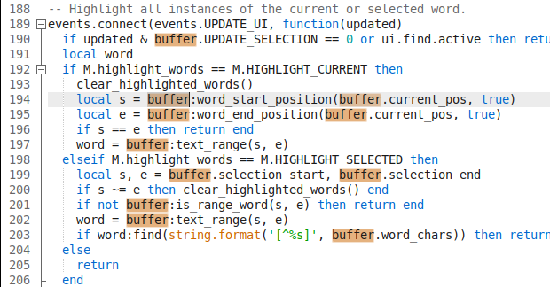

[`textadept.editing.highlight_words`]: api.html#textadept.editing.highlight_words

#### Autocompletion and Documentation

Textadept provides buffer-based word completion. It can also autocomplete symbols for programming
languages and display documentation for functions and other symbols.

You can show word completion candidates for partially-typed words via `Ctrl+Enter` on Windows
and Linux, `⌘↩` on macOS, and `^Enter` in the terminal version. Continuing to type
changes the suggested completion. Use the arrow keys to navigate within the list and press
`Enter` to insert the rest of the selected word. By default, the list of completions comes
from the current buffer. You can configure Textadept to look in all open buffers by setting
[`textadept.editing.autocomplete_all_words`][]. For example, in *~/.textadept/init.lua*:

    textadept.editing.autocomplete_all_words = true

For languages that support it, you can show symbol completion candidates at the current position
via `Ctrl+Space` on Windows and Linux, `⌘Space` or `^Space` on macOS, and `^Space` in the
terminal version.

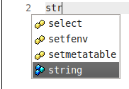
&nbsp;&nbsp;&nbsp;&nbsp;
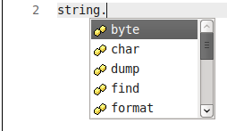

Also for languages that support it, you can show any known documentation for the current symbol
via `Ctrl+?` on Windows and Linux, `⌘?` or `^?` on macOS, and `M-?` or `^?` in the terminal
version. Textadept has built-in autocompletion and documentation support for Lua and C, including
for its own Lua API.

Textadept's framework for providing symbol autocompletion and documentation relies on
[autocompleter][] functions and [API files][], which are often supplied by [language][]
[modules](#modules). You can use this framework to write your own autocompletion routines.

[`textadept.editing.autocomplete_all_words`]: api.html#textadept.editing.autocomplete_all_words
[autocompleter]: api.html#textadept.editing.autocompleters
[API files]: api.html#textadept.editing.api_files
[language]: api.html#_M

#### Text Selections

Textadept has three kinds of text selections: contiguous, multiple, and rectangular.

You can create contiguous selections as follows:

* Make an arbitrary selection anchored at the caret by pressing the arrow keys, home/end, page
  up/down, etc. while holding down the `Shift` key, or by simply clicking and dragging the mouse.
* The terminal version can also make an arbitrary selection by entering selection mode via `^^`
  and using normal movement keys. This feature is available since some terminals do not recognize
  `Shift` with movement keys. While in selection mode, swap the start and end positions via
  `^]` in order to alter the selection from its opposite side. Exit selection mode by typing
  text, deleting text, performing an action that changes text, or by pressing `^^` again.
* Select the current word via `Ctrl+D` on Windows and Linux, `⌘D` on macOS, and `^D` in the
  terminal version. Repeated use of this action selects subsequent occurrences of that word as
  additional (multiple) selections. Undo the most recent multiple selection via `Ctrl+Alt+D`,
  `^⌘D`, or `M-D`.
* Select the current line via `Ctrl+L` on Windows and Linux, `⌘L` on macOS, and `^L` in the
  terminal version.
* Double click to select a word, and triple-click to select a line.
* Click and optionally drag within the line number margin to select whole lines.
* Select the current paragraph via `Ctrl+Shift+P` on Windows and Linux, `⌘⇧P` on macOS,
  and `M-^P` in the terminal version. Paragraphs are surrounded by one or more blank lines.
* Select all buffer text via `Ctrl+A` on Windows and Linux, `⌘A` on macOS, and `^A` in the
  terminal version.
* Select text between matching delimiters (parentheses, brackets, braces, single quotes,
  double-quotes, back quotes, and HTML/XML tag characters) via `Ctrl+Shift+M` on Windows and
  Linux, `⌘⇧M` on macOS, and `M-^M` in the terminal version. Repeated use of this action
  toggles the selection of the delimiters themselves.

You can create multiple selections as follows:

* Add another selection by holding down `Ctrl`, clicking, and optionally dragging the mouse
  over a range of text.
* Select as an additional selection the next occurrence of the current word via `Ctrl+D`
  on Windows and Linux, `⌘D` on macOS, and `^D` in the terminal version.

Textadept mirrors any typed or pasted text at each selection.

You can create a rectangular selection as follows:

* Press the arrow keys, home/end, or page up/down, while holding down `Alt+Shift` on Windows
  and Linux, `^⇧` on macOS, and `M-S-` in the terminal version.
* Click and drag the mouse while holding down the `Alt` key on Windows and Linux, and `⌥`
  on macOS.
* Click and drag the mouse without holding down any modifiers (thus making a normal, multi-line
  selection), press and hold down the `Alt` key on Windows and Linux, `⌥` on macOS, and `M-`
  in the terminal version, and then continue dragging the mouse. This feature is available
  because some window managers in Linux consume `Alt+Shift` + arrow keys and `Alt` + mouse drag.

You are permitted to create a zero-width rectangular selection that spans multiple lines,
and for this kind of selection, Textadept mirrors any typed or pasted text on all of those lines.

&nbsp;&nbsp;&nbsp;&nbsp;

You can also copy rectangular blocks of text and paste them into rectangular blocks of the
same size.

**Note:** macOS does not support directly pasting into rectangular selections. Instead, use the
[Lua Command Entry](#lua-command-entry) and enter `replace_rectangular(ui.clipboard_text)`
after copying a block of text.

#### Text Transformations

Textadept can apply many different transformations to the current word, line, and selected text.

* Enclose the current word or selected text within delimiters like parentheses, braces, brackets,
  single quotes, double quotes, or HTML/XML tags using the key bindings listed in the "Edit >
  Selection" submenu.
* Convert the selected text or current word to upper or lower case via `Ctrl+Shift+U` or
  `Ctrl+U`, respectively, on Windows and Linux; `⌘U` or `⌘⇧U`, respectively, on macOS;
  and `M-^U` or `M-U` in the terminal version.
* Increase or decrease the indentation of the selected lines via `Tab` or `Shift+Tab`,
  respectively, on Windows and Linux; `⇥` or `⇧⇥`, respectively on macOS; and `Tab` or
  `S-Tab` in the terminal version. You do not have to select whole lines; selecting any part
  of a line is sufficient.
* Move the current or selected line(s) up or down via `Ctrl+Alt+Shift+Up` or
  `Ctrl+Alt+Shift+Down`, respectively, on Windows and Linux; and `^⌘⇧⇡` or `^⌘⇧⇣`,
  respectively, on macOS. You do not have to select whole lines; selecting any part of a line
  is sufficient.
* Comment out code on the current or selected line(s) via `Ctrl+/` on Windows and Linux, `⌘/`
  on macOS, and `^?` or `M-/` in the terminal version. You do not have to select whole lines;
  selecting any part of a line is sufficient.

You can auto-enclose selected text between any typed punctuation character (taking into account
[`textadept.editing.auto_pairs`][]) by setting [`textadept.editing.auto_enclose`][]. For example,
in your *~/.textadept/init.lua*:

    textadept.editing.auto_enclose = true

[`textadept.editing.auto_pairs`]: api.html#textadept.editing.auto_pairs
[`textadept.editing.auto_enclose`]: api.html#textadept.editing.auto_enclose

#### Navigate Through History

Textadept records buffer positions within views over time and allows for navigating through
that history. Navigate backward or forward via `Ctrl+[` or `Ctrl+]`, respectively, on Windows
and Linux; `⌘[` or `⌘]`, respectively, on macOS; and `M-[` or `M-]`, respectively, in the
terminal version.

#### Go To Line

You can go to a specific line in the current buffer via `Ctrl+G` on Windows and Linux, `⌘G`
on macOS, and `^G` in the terminal version. Enter the line number to go to in the prompt,
and press `Enter` or click `OK`.

#### Bookmarks

Bookmarks are markers attached to lines of interest. They move in sync with the lines they were
added to as buffer text is inserted and deleted. Bookmarks show up in the left-hand margin
after line numbers. Textadept allows you to bookmark lines and jump back to them later. The
following key bindings apply for bookmarks:

* Toggle a bookmark on the current line via `Ctrl+K` on Windows and Linux, `⌘K` on macOS,
  and `^K` in the terminal version.
* Go to the next bookmarked line via `Ctrl+Alt+K` on Windows and Linux, `^⌘K` on macOS, and
  `M-K` in the terminal version.
* Go to the previously bookmarked line via `Ctrl+Alt+Shift+K` on Windows and Linux, `^⌘⇧K`
  on macOS, and `M-S-K` in the terminal version.
* Go to the bookmarked line selected from a list via `Ctrl+Shift+K` on Windows and Linux,
  `⌘⇧K` on macOS, and `M-^K` in the terminal version.
* Clear all bookmarks in the current buffer via the "Tools > Bookmarks > Clear Bookmarks"
  menu item.

#### Macros

Macros allow you to quickly record a series of edits and play them back without having to write
a custom Lua script. The following key bindings apply for macros:

* Start and stop recording a macro via `Alt+,` on Windows and Linux, `^,` on macOS, and `M-,`
  in the terminal version. The status bar will display when a macro starts and stops recording.
* Play back the most recently recorded macro via `Alt+.` on Windows and Linux, `^.` on macOS,
  and `M-.` in the terminal version.

You can use the "Tools > Macros" menu to save the most recently recorded macro to a file,
and to load one for playback on demand.

#### Snippets

Snippets are dynamic text templates that can be inserted into the buffer on demand. They
are composed of any combination of plain text, placeholders for interactive input, mirrors
and transforms for interactive input, and arbitrary Lua and Shell code. Snippets eliminate
the need for typing repetitive code constructs like class definitions, getters and setters,
control structures, API calls, and more.

&nbsp;&nbsp;&nbsp;&nbsp;

A snippet has a trigger word associated with snippet text in the [`snippets`][]
table. Language-specific snippets are in a subtable assigned to their language's lexer
name. Snippets may also be the contents of files in a snippet directory, with file names being the
trigger word. The [snippets documentation][] describes snippets and their contents in more detail.

The following key bindings apply for snippets:

* Insert a snippet from a list of available snippets via the "Tools > Snippets > Insert
  Snippet..." menu item. Typing part of a snippet trigger in the dialog filters the list, with
  spaces being wildcards. The arrow keys move the selection up and down. Pressing `Enter`,
  selecting `OK`, or double-clicking on a snippet inserts it into the current buffer. (The
  terminal requires pressing `Enter`.)
* Show completion candidates for a partially-typed snippet trigger word via the "Tools > Snippets >
  Complete Trigger Word" menu item. Continuing to type changes the suggested completion. Use the
  arrow keys to navigate within the list and press `Enter` to insert the rest of the trigger word.
* Insert a snippet based on the trigger word behind the caret via `Tab` on Windows, Linux,
  and in the terminal version, and `⇥` on macOS. You can insert another snippet within an
  active snippet. A previously active snippet will pick up where it left off after a nested
  snippet finishes.
* Navigate to the next placeholder in the current snippet via `Tab` on Windows, Linux, and in
  the terminal version, and `⇥` on macOS.
* Navigate to the previous placeholder in the current snippet via `Shift+Tab` on Windows and Linux,
  `⇧⇥` on macOS, and `S-Tab` in the terminal version. If there is no previous placeholder,
  the current snippet is canceled.
* Cancel the current snippet via `Esc`.

[`snippets`]: api.html#_G.snippets
[snippets documentation]: api.html#textadept.snippets

#### Code Folding

Textadept can temporarily hide blocks of code in supported languages. Markers in the margin to
the left of code denote fold points. Clicking on those markers toggles folding. You can toggle
folding for the current block via `Ctrl+}` on Windows and Linux, `⌘}` on macOS, and `M-}`
in the terminal version.

#### Virtual Space

Textadept normally constrains the caret to remain within text lines. Enabling virtual space
allows you to move the caret into the space beyond the ends of lines. Toggle virtual space via
the "View > Toggle Virtual Space" menu item.

#### Key Bindings

Key bindings are simply commands (Lua functions) assigned to key sequences in the [`keys`][]
table. Key sequences are composed of an ordered combination of modifier keys followed by either
the key's inserted character or, if no such character exists, the string representation of the
key according to [`keys.KEYSYMS`][]. Language-specific keys are in a subtable assigned to their
language's lexer name. Key sequences can also be assigned tables of key bindings to create
key chains (e.g. Emacs `C-x` prefix). Key bindings can be grouped into modes such that while
a mode is active, Textadept ignores all key bindings outside that mode until the mode is unset
(e.g. Vim-style modal editing). The [keys documentation][] describes all of this in more detail.

[`keys`]: api.html#keys
[`keys.KEYSYMS`]: api.html#keys.KEYSYMS
[keys documentation]: api.html#keys

---
### Compile, Run, Build, and Test
---

Textadept knows most of the commands that compile and/or run code in source files. It also knows
some of the commands that build projects, and you can tell the editor how to run your project's
test suite. Finally, you can run arbitary commands in the context of your project. Textadept
recognizes many of the warning and error messages emitted by those commands and marks them as
they occur in compile/run/build/test output. Double-clicking on a line with a warning or error
jumps to its source.

The following key bindings apply for compiling and running source files, and for building
projects and running tests and project commands:

* Compile the current file via `Ctrl+Shift+C` on Windows and Linux, `⌘⇧C` on macOS, and
  `M-^C` in the terminal version.
* Run the current file via `Ctrl+R` on Windows and Linux, `⌘R` on macOS, and `^R` in the
  terminal version.
* Build the current project via `Ctrl+Shift+B` on Windows and Linux, `⌘⇧B` on macOS, and
  `M-^B` in the terminal version.
* Run tests for the current project via `Ctrl+Shift+T` on Windows and Linux, `⌘⇧T` on macOS,
  and `M-^T` in the terminal version.
* Run a command for the current project via `Ctrl+Shift+R` on Windows and Linux, `⌘⇧R`
  on macOS, and `M-^R` in the terminal version.
* Stop the currently running compile, run, build, or test process via `Ctrl+Shift+X` on Windows
  and Linux, `⌘⇧X` on macOS, and `M-^X` in the terminal version.
* Go to the source of the next recognized warning or error via `Ctrl+Alt+E` on Windows and Linux,
  `^⌘E` on macOS, and `M-E` in the terminal version.
* Go to the source of the previously recognized warning or error via `Ctrl+Alt+Shift+E` on
  Windows and Linux, `^⌘⇧E` on macOS, and `M-S-E` in the terminal version.
* Go to the source of the recognized warning or error on the current line via `Enter`.

Prior to running a compile, run, build, or test command, Textadept will prompt you with either:

1. A command it thinks is appropriate for the current file or project.
2. A command you have specified for this current context.
3. A command you have previously run in this context.
4. A blank command for you to fill in.

Make any necessary changes to the command and then run it by pressing `Enter`. You can cycle
through command history via `Up` and `Down` on Windows, Linux, and the terminal version, and
`⇡` and `⇣` on macOS. You can opt out of running the command via `Esc`. In most cases,
Textadept will remember compile and run commands on a per-filename basis as you use them,
as well as build, test, and project commands on a per-directory basis.

You can change or add compile, run, build, test, and project commands by modifying
the [`textadept.run.compile_commands`][], [`textadept.run.run_commands`][],
[`textadept.run.build_commands`][], [`textadept.run.test_commands`][], and
[`textadept.run.run_project_commands`][] tables, respectively. For example, in your
*~/.textadept/init.lua*:

    textadept.run.compile_commands.foo = 'foo "%f"'
    textadept.run.run_commands.foo = './"%e"'

    textadept.run.build_commands['/path/to/project'] = 'make -C src -j4'
    textadept.run.test_commands['/path/to/project'] = 'lua tests.lua'
    textadept.run.run_project_commands['/path/to/project'] = function()

    end

**Tip:** you can set compile and run commands on a per-filename basis.

[`textadept.run.run_in_background`]: api.html#textadept.run.run_in_background
[`textadept.run.compile_commands`]: api.html#textadept.run.compile_commands
[`textadept.run.run_commands`]: api.html#textadept.run.run_commands
[`textadept.run.build_commands`]: api.html#textadept.run.build_commands
[`textadept.run.test_commands`]: api.html#textadept.run.test_commands
[`textadept.run.run_project_commands`]: api.html#textadept.run.run_project_commands

When you execute a compile, run, build, test, or project command, that command's output is printed
to a temporary buffer in real-time. You can configure Textadept to print output in the background
by setting [`textadept.run.run_in_background`][]. For example, in your *~/.textadept/init.lua*:

    textadept.run.run_in_background = true

---
### Modules
---

Modules are packages of Lua code that provide functionality for Textadept. Most of the
editor's features come from individual modules (see Textadept's *core/* and *modules/*
directories). Textadept can load modules when the application starts up, or it can load modules
on-demand in response to events. Once a module is loaded, it persists in memory and is never
unloaded. Textadept attempts to load, in order, a given module from the following locations:

1. Your *~/.textadept/modules/* directory.
2. Textadept's *modules/* directory.

**Tip:** placing modules in your user data directory avoids the possibility of you overwriting
them when you update Textadept. These modules also take precedence over the ones installed
with Textadept.

Textadept will only load modules it is explicitly told to load (e.g. from your
*~/.textadept/init.lua*). For example, in your *~/.textadept/init.lua*:

    local ctags = require('ctags')
    ctags.f12 = ctags.goto_tag

You can automatically load a "language module" (if it exists) after opening a file of that type:

    events.connect(events.LEXER_LOADED, function(name)
      if package.searchpath(name, package.path) then require(name) end
    end)

**Note:** lexer language names are typically the names of lexer files in your
*~/.textadept/lexers/* directory and Textadept's *lexers/* directory.

#### Developing Modules

Modules follow the Lua package model: a module is either a single Lua file or a group of Lua files
in a directory that contains an *init.lua* file (which is the module's entry point). The name
of the module is its file name or directory name, respectively. Here are some basic guidelines
for developing modules and some things to keep in mind:

* Modules should return a table of functions and fields that are defined locally, rather than
  globally. (This is standard Lua practice.) That way, the construct `local foo = require('foo')`
  behaves as expected.
* Modules should not define global variables, as all modules share the same Lua state.
* Modules should only be named after lexer languages if they provide language-specific
  functionality.
* Modules must not call any functions that create buffers and views (e.g. `ui.print()`,
  `io.open_file()`, and `buffer.new()`) at file-level scope. Buffers and views can only be
  created within functions assigned to keys, associated with menu items, or connected to events.

**Tip:** you do not need to have a language module in order to have language-specific editing
features. You can simply put language-specific features inside an [`events.LEXER_LOADED`][]
event handler. For example, in your *~/.textadept/init.lua*:

    -- Setup language-specific indentation settings.
    events.connect(events.LEXER_LOADED, function(name)
      if name == 'python' then buffer.tab_width, buffer.use_tabs = 4, false end
    end)

[`events.LEXER_LOADED`]: api.html#events.LEXER_LOADED

---
### Themes
---

Themes customize Textadept's look and feel. The editor comes with three built-in themes:
"light", "dark", and "term". The default theme for the GUI and terminal versions is "light"
and "term", respectively.

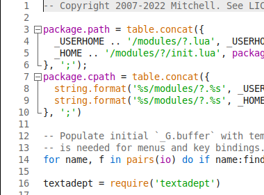
&nbsp;&nbsp;
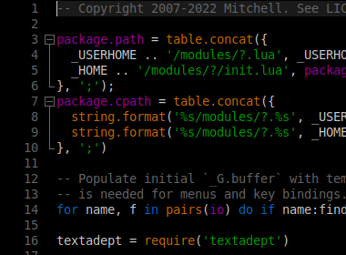
&nbsp;&nbsp;
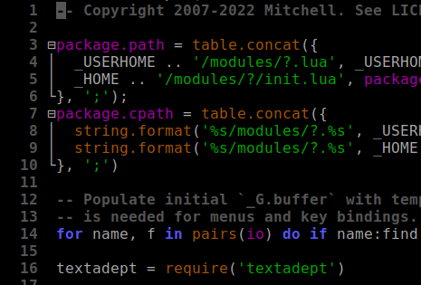

A theme consists of a single Lua file, and is typically responsible for:

* Defining the [colors][] and [text display settings][] (styles) used in syntax highlighting.
* Assigning colors to various UI elements such as the caret, text selections, margin markers,
  and documentation popups.
* Specifying what symbols to use for margin markers and how to display visual elements like
  the brace match indicator and snippet placeholders.
* Specifying the find & replace pane entry font name and size.

[colors]: api.html#view.colors
[text display settings]: api.html#view.styles

Textadept attempts to load, in order, a given theme from the following locations:

1. Your *~/.textadept/themes/* directory.
2. Textadept's *themes/* directory.

**Tip:** placing themes in your user data directory avoids the possibility of you overwriting
them when you update Textadept. These themes also take precedence over the ones installed
with Textadept.

You can set Textadept's theme using [`view.set_theme()`][]. You can also tweak a theme's styles
on a per-language basis. For example, in your *~/.textadept/init.lua*:

    if not CURSES then
      view:set_theme('light', {font = 'Monospace', size = 12})
    end

    -- Color Java class names black instead of the default yellow.
    events.connect(events.LEXER_LOADED, function(name)
      if name ~= 'java' then return end
      local default_fore = view.style_fore[view.STYLE_DEFAULT]
      view.style_fore[buffer:style_of_name(lexer.CLASS)] = default_fore
    end)

**Tip:** you can experiment with themes without having to restart Textadept by using the
[`reset()`][] command in the [Lua Command Entry](#lua-command-entry). Once you make changes
to either your *~/.textadept/init.lua* or theme file, issuing the `reset` command will reload
your changes.

[`view.set_theme()`]: api.html#view.set_theme
[`reset()`]: api.html#reset

The widgets in the GTK version of Textadept cannot be themed using Lua theme files. Instead, you
must use [GTK Themes][] or [GTK CSS][], which are part of the GUI toolkit Textadept uses. The
exception to this is find & replace entry font, which can be changed.

[GTK Themes]: https://www.gnome-look.org/browse?cat=135&ord=latest
[GTK CSS]: https://docs.gtk.org/gtk3/css-overview.html

---
### Scripting
---

Nearly every aspect of Textadept can be scripted, or controlled, using Lua. Textadept contains
its own internal copy of [Lua 5.4][], which is largely unmodified compared to the official Lua
release. The main difference is that Textadept's Lua does not have any compatibility options
turned on for previous versions of Lua.

Being an event-driven application, Textadept simply responds to input like key presses,
mouse clicks, and state changes by running Lua code (more specifically, executing Lua
functions). For example, when you press a key, Textadept emits an `events.KEYPRESS` event,
which its *core/keys.lua* is listening for. When a sequence like `Ctrl+O` on Windows and Linux
is recognized, *core/keys.lua* looks up which Lua function is assigned to the `keys['ctrl+o']`
key. By default, it is `io.open_file()`, so that function is executed and the user is prompted
for a file to open. You could bind a different function to that key and Textadept will duly
execute it. Similarly, when the editor opens a file via `io.open_file()`, that function emits
a `events.FILE_OPENED` event, which you could listen for in your *~/.textadept/init.lua* and
perform your own action, such as loading some project-specific tools for editing that file.

Your *~/.textadept/init.lua* is the entry point to scripting Textadept. In this file you can set
up custom key bindings, menu items, and event handlers that will perform custom actions. Here
are some ideas:

* Define custom key bindings and menu items that manipulate buffer contents via the extensive
  [`buffer`][] API.
* Extend Textadept's File menu with a menu item that prompts for a commit message using an
  [interactive dialog][], and then invokes a [project command][] that commits the current file
  to version control using the provided message.
* Listen for the `events.FILE_SAVED` [event][] and [spawn][] an asynchronous process that runs
  a syntax checker, linter, or formatter on a source file when it is saved.
* Start searches with the word under the caret by substituting the "Search > Find" menu item
  and key binding functions with a custom function that pre-populates `ui.find.find_entry_text`
  before calling `ui.find.focus()` to show the find & replace pane.
* Auto-save files as you switch between buffers by listening for the `events.BUFFER_BEFORE_SWITCH`
  event and calling `buffer:save()` for buffers that have a `buffer.filename`. In the GUI version,
  you can even auto-save on a timer via `timeout()`.
* Overload Textadept's find & replace capabilities to use Lua patterns instead of regex by
  reacting to `events.FIND` and `events.REPLACE` before Textadept can, and then determining
  whether or not the editor's default routines should handle those events.

Textadept's [Lua API][] is extensively documented and serves as the ultimate resource when it
comes to scripting the editor. The claim "Textadept gives you complete control over nearly the
entire application using Lua" is not an exaggeration!

[Lua 5.4]: https://www.lua.org/manual/5.4
[`buffer`]: api.html#buffer
[interactive dialog]: api.html#ui.dialogs
[project command]: api.html#textadept.run.run_project
[event]: api.html#events
[spawn]: api.html#os.spawn
[Lua API]: api.html

#### Generate Autocompletion and Documentation Files

You can generate for use with Textadept [autocompletion and
documentation](#autocompletion-and-documentation) files for your Lua modules. Simply run
[LuaDoc][] with Textadept's *modules/lua/tadoc.lua* doclet. For example:

    cd _HOME
    luadoc -d [output_path] --doclet modules/lua/tadoc [/path/to/module(s)]

where `_HOME` is the path where you installed Textadept and `output_path` is an arbitrary path
to write the generated *tags* and *api* files to. (Note that LuaDoc does not like absolute paths
to doclets, so running `luadoc` from `_HOME` is one way to get it to work.) You can then have
Textadept load and use those autocompletion and documentation files when editing Lua code. For
example, in your *~/.textadept/init.lua*:

    local loaded_tags = false
    events.connect(events.LEXER_LOADED, function(name)
      if name ~= 'lua' or loaded_tags then return end
      local lua = require('lua')
      lua.tags[#lua.tags + 1] = '/path/to/tags'
      loaded_tags = true
    end)
    table.insert(textadept.editing.api_files.lua, '/path/to/api')

[LuaDoc]: https://keplerproject.github.com/luadoc

---
### Compiling
---

Textadept can be built on Windows, macOS, or Linux using [CMake][]. CMake will automatically
detect which platforms you can compile Textadept for (e.g. Qt, GTK, and/or Curses) and build
for them. On Windows and macOS you can then use CMake to create a self-contained application
to run from anywhere. On Linux you can either use CMake to install Textadept, or place compiled
binaries into Textadept's root directory and run it from there.

#### Requirements

Requirements:

* [CMake][] 3.16+
* A C and C++ compiler, such as:
  - [GNU C compiler][] (*gcc*) 7.1+
  - [Microsoft Visual Studio][] 2019+
  - [Clang][] 9+
* A UI toolkit (at least one of the following):
  - [Qt][] 5 development libraries for the GUI version
  - [GTK][] 3 development libraries for the GUI version (GTK 2.24 is also supported)
  - [ncurses] development libraries (wide character support) for the terminal version

**macOS Note:** [XCode][] provides Clang.

**Linux Note:** these requirements should be readily available from a package manager. On Ubuntu
for example, these dependencies would be provided by the `build-essential`, `qtbase5-dev`,
`libgtk-3-dev` (or `libgtk2.0-dev`), and `libncurses-dev` packages.

[CMake]: https://cmake.org
[GNU C compiler]: https://gcc.gnu.org
[Microsoft Visual Studio]: https://visualstudio.microsoft.com/
[Clang]: https://clang.llvm.org
[Qt]: https://www.qt.io
[GTK]: https://www.gtk.org/download/linux.php
[ncurses]: https://invisible-island.net/ncurses/#download_ncurses
[XCode]: https://developer.apple.com/xcode/

#### Compiling

Basic procedure:

1. Configure CMake to build Textadept by pointing it to Textadept's source directory (where
   *CMakeLists.txt* is) and specifying a binary directory to compile to.
2. Build Textadept.
3. Either copy the built Textadept binaries to Textadept's directory or use CMake to install it.

For example:

    cmake -S . -B build_dir -D CMAKE_INSTALL_PREFIX=build_dir/install
    cmake --build build_dir -j # compiled binaries are in build_dir/
    cmake --install build_dir # self-contained installation is in build_dir/install/

On Windows, you can either use the Visual Studio solution to build Textadept, or run `cmake
--build -j` from the build directory in Visual Studio's developer command prompt.

**Tip:** you can use the environment variable `TEXTADEPT_HOME` to specify the location of
Textadept's root directory. Doing so allows you to run Textadept executables directly from the
binary directory without having to install or copy them.

**Windows and macOS Note:** when installing the Qt version of Textadept, Qt's *bin/* directory
should be in your `%PATH%` or `$PATH`, respectively.

CMake boolean variables that affect the build:

* `NIGHTLY`: Whether or not to build Textadept with bleeding-edge dependencies (i.e. the nightly
   version). Defaults to off.
* `QT`: Unless off, builds the Qt version of Textadept. The default is auto-detected.
* `GTK3`: Unless off, builds the Gtk 3 version of Textadept. The default is auto-detected.
* `GTK2`: Unless off, builds the Gtk 2 version of Textadept. The default is auto-detected.
* `CURSES`: Unless off, builds the Curses (terminal) version of Textadept. The default is
   auto-detected.

---
### Appendix
---

#### Regex and Lua Pattern Syntax

The following table outlines Regex and Lua Pattern syntax:

Regex | Lua | Meaning
-|-|-
. | . | Matches any character
[[:alpha:]] |%a | Matches any letter
\d | %d | Matches any digit
[[:lower:]] | %l | Matches any lower case character
[[:punct:]] | %p | Matches any punctuation character
\s | %s | Matches any space character
[[:upper:]] | %u | Matches any upper case character
\w | %w | Matches any alphanumeric character (Regex includes '_')
[[:xdigit:]] | %x | Matches any hexadecimal digit
[*set*] | [*set*] | Matches any character in *set*, including ranges like A-Z
[^*set*] | [^*set*] | Matches the complement of *set*
\* | \* | Matches the previous item (Regex) or class (Lua) 0+ times
\+ | + | Matches the previous item or class 1+ times
\*? | - | Matches the previous item or class 0+ times, non-greedily
\+? | | Matches the previous item 1+ times, non-greedily
? | ? | Matches the previous item or class once or not at all
{*m*,*n*} | | Matches the previous item between *m* and *n* times
{*m*,} | | Matches the previous item at least *m* times
{*m*} | | Matches the previous item exactly *m* times
\| | | Matches either the previous item or the next item
&nbsp;  | %b*xy* | Matches a balanced string bounded by *x* and *y*
&nbsp; | %f[*set*] | Matches a position between characters not in and in *set*
\\< | | Matches the beginning of a word
\\> | | Matches the end of a word
\b | | Matches a word boundary
^ | ^ | Matches the beginning of a line unless inside a set
$ | $ | Matches the end of a line unless inside a set
( | ( | The beginning of a captured matching region
) | ) | The end of a captured matching region
(?:*...*) | | Consider matched "*...*" as a single, uncaptured item
\\*n* | %*n* | The *n*th captured matching region's texta
\\*x* | %*x* | Non-alphanumeric character *x*, ignoring special meaning

aIn replacement text, "\0" (Regex) or "%0" (Lua) represents all matched text.

Textadept's regular expressions are based on the C++11 standard for ECMAScript. There are a
number of references for this syntax on the internet, including:

* [ECMAScript syntax C++ reference](https://www.cplusplus.com/reference/regex/ECMAScript/)
* [Modified ECMAScript regular expression grammar](https://en.cppreference.com/w/cpp/regex/ecmascript)
* [Regular Expressions (C++)](https://docs.microsoft.com/en-us/cpp/standard-library/regular-expressions-cpp)

More information on Lua patterns can be found in the [Lua 5.4 Reference
Manual](https://www.lua.org/manual/5.4/manual.html#6.4.1).

#### Terminal Version Compatibility

Textadept's terminal version requires a font with good glyph support (like DejaVu Sans Mono or
Liberation Mono), and lacks some GUI features due to the terminal's constraints:

* No alpha values or transparency.
* No images in autocompletion lists. Instead, autocompletion lists show the first character in
  the string passed to [`buffer.register_image()`][].
* No buffered or two-phase drawing.
* Carets cannot have a period, line style, or width.
* No drag and drop.
* Edge lines may be obscured by text.
* No extra line ascent or descent.
* No fold lines above and below lines.
* No hotspot underlines on mouse hover.
* No indicators other than `INDIC_ROUNDBOX` and `INDIC_STRAIGHTBOX`, although neither has
  translucent drawing and `INDIC_ROUNDBOX` does not have rounded corners.
* Some complex marker symbols are not drawn properly or at all.
* No mouse cursor types.
* Only up to 16 colors recognized, regardless of how many colors the terminal
  supports. Unrecognized colors default to white.
* Not all key sequences are recognized properly.
* No style settings like font name, font size, or italics.
* No X selection, primary or secondary, integration with the clipboard.
* No zoom.
* When using the mouse in the Windows console, Shift+Double-click extends selections and
  quadruple-clicking inside a selection collapses it.

[`buffer.register_image()`]: api.html#buffer.register_image

#### Directory Structure

Textadept's directory structure is organized as follows:

* *core/*: Contains Textadept's core Lua modules. These modules are essential for the
  application to run. They provide Textadept's Lua to C interface, event framework, file and
  lexer interactions, and localization.
* *lexers/*: Houses the lexer modules that analyze source code for syntax highlighting.
* *modules/*: Contains modules for editing text and source code.
* *themes/*: Contains built-in themes that customize the look and feel of Textadept.
* *iconengines/*, *imageformats/*, *platforms/*, *styles/*, and *translations/*: Qt support
  directories and only appear in the Windows package.

#### Technologies

Textadept is composed of the following technologies:

* [Qt][]: cross-platform GUI toolkit
* [GTK][]: cross-platform GUI toolkit
* [ncurses][]: terminal UI library for Linux and macOS
* [pdcurses][]: terminal UI library for Windows
* [cdk][]: terminal UI widget toolkit
* [libtermkey][]: terminal keyboard entry handling library
* [Scintilla][]: core text editing component
* [Lexilla][]: core syntax highlighting library for Scintilla
* [Scinterm][]: curses (terminal) platform for Scintilla
* [Scintillua][]: syntax highlighting for Scintilla using Lua lexers
* [Lua][]: core scripting language
* [LPeg][]: Lua pattern matching library for syntax highlighting
* [LuaFileSystem][]: Lua library for accessing the host filesystem
* [iconv][]: library for converting text to and from Unicode

[Qt]: https://www.qt.io
[GTK]: https://www.gtk.org
[Scintilla]: https://scintilla.org
[Lexilla]: https://scintilla.org/Lexilla.html
[Scinterm]: https://orbitalquark.github.io/scinterm
[Scintillua]: https://orbitalquark.github.io/scintillua
[Lua]: https://www.lua.org
[LPeg]: http://www.inf.puc-rio.br/~roberto/lpeg/lpeg.html
[LuaFileSystem]: https://keplerproject.github.io/luafilesystem
[ncurses]: https://invisible-island.net/ncurses
[pdcurses]: http://pdcurses.sourceforge.net
[cdk]: https://invisible-island.net/cdk
[libtermkey]: http://www.leonerd.org.uk/code/libtermkey
[iconv]: https://www.gnu.org/software/libiconv

#### Migrating from Textadept 11 to 12

##### API Changes

Old API | Change | New API
-|:-:|-
**_G**||
N/A | Added | [GTK](api.html#GTK), [QT](api.html#QT)
[OSX][] | Changed | Always true on macOS, not just in the GUI version
**_M**| Removed | N/A[a](#language-module-changes)
**buffer**||
[tab_label][] | Changed | Write-only
**events**||
[KEYPRESS][] | Changed | Changed arguments
[TAB_CLICKED][] | Changed | Changed arguments
**io**||
N/A | Added | [ensure_final_newline][]b
[quick_open()][] | Changed | Removed *opts* parameter
**lexer**||
N/A | Added | [names()][]
colors | Renamed | [view.colors][]
styles | Renamed | [view.styles][]
fold\* | Renamed | view.fold\*
token() | Renamed | [tag()][], and made into an instance method
property_expanded | Removed | N/A
starts_line() | Changed | Added *allow_indent* parameter
last\_char\_includes() | Renamed | [after_set()][]
[word_match()][] | Changed | Can also be used as an instance method
N/A | Added | [set_word_list()][]
N/A | Added | [number_()][] and friends
[to_eol()][] | Changed | *prefix* parameter is optional
fold\_line\_groups | Removed | N/A
**textadept.editing**||
INDIC_BRACEMATCH | Removed | N/Ac
brace_matches | Removed | N/Ad
[auto_pairs][] | Changed | Keys are string characters, not byte values
[typeover_chars][] | Changed | Keys are string characters, not byte values
**textadept.file_types**| Removed | N/A
extensions | Renamed | [lexer.detect_extensions][]
patterns | Renamed | [lexer.detect_patterns][]
select_lexer() | Replaced | `textadept.menu.menubar[L['Buffer']]` `[L['Select Lexer...']][2]`
**textadept.run**||
error_patterns | Removed | N/A
set_arguments() | Removed | N/Ae
N/A | Added | [run_project()][], [run_project_commands][]
N/A | Added | [INDIC_WARNING][], [INDIC_ERROR][]
**ui**||
N/A | Added | [output()][]
silent_print | Replaced | [print_silent()][], [output_silent()][]
_print() | Renamed | [print_to()][]
[switch_buffer()][] | Changed | Removed *zorder* parameter in favor of [buffer_list_zorder][]
N/A | Added | [suspend()][]
**ui.command_entry**||
[run()][] | Changed | Changed parameter list
**ui.dialogs**||
msgbox(), ok\_msgbox(), yesno\_msgbox() | Replaced | [message()][]
inputbox(), standard_inputbox() | Replaced | [input()][]
secure\_inputbox(), secure\_standard\_inputbox() | Removed | N/A
fileselect(), filesave() | Replaced | [open()][], [save()][]
progressbar() | Replaced | [progress()][]
filteredlist() | Replaced | [list()][]
dropdown(), standard_dropdown() | Removed | N/A
textbox(), optionselect(), colorselect(), fontselect() | Removed | N/A
**view**||
N/A | Added | [set_styles()][]

bNo longer part of `textadept.editing.strip_trailing_spaces` 
cUse view.STYLE_BRACEBAD and view.STYLE_BRACELIGHT instead 
dAngles as brace characters is auto-detected now 
eSee below how compile and run commands have changed 

[OSX]: api.html#OSX
[tab_label]: api.html#buffer.tab_label
[KEYPRESS]: api.html#events.KEYPRESS
[TAB_CLICKED]: api.html#events.TAB_CLICKED
[ensure_final_newline]: api.html#io.ensure_final_newline
[quick_open()]: api.html#io.quick_open
[names()]: api.html#lexer.names
[view.colors]: api.html#view.colors
[view.styles]: api.html#view.styles
[tag()]: api.html#lexer.tag
[after_set()]: api.html#lexer.after_set
[word_match()]: api.html#lexer.word_match
[set_word_list()]: api.html#lexer.set_word_list
[number_()]: api.html#lexer.number_
[to_eol()]: api.html#lexer.to_eol
[auto_pairs]: api.html#textadept.editing.auto_pairs
[typeover_chars]: api.html#textadept.editing.typeover_chars
[lexer.detect_extensions]: api.html#lexer.detect_extensions
[lexer.detect_patterns]: api.html#lexer.detect_patterns
[run_project()]: api.html#textadept.run.run_project
[run_project_commands]: api.html#textadept.run.run_project_commands
[INDIC_WARNING]: api.html#textadept.run.INDIC_WARNING
[INDIC_ERROR]: api.html#textadept.run.INDIC_ERROR
[output()]: api.html#ui.output
[print_silent()]: api.html#ui.print_silent
[output_silent()]: api.html#ui.output_silent
[print_to()]: api.html#ui.print_to
[switch_buffer()]: api.html#ui.switch_buffer
[buffer_list_zorder]: api.html#ui.buffer_list_zorder
[suspend()]: api.html#ui.suspend
[run()]: api.html#ui.command_entry.run
[message()]: api.html#ui.dialogs.message
[input()]: api.html#ui.dialogs.input
[open()]: api.html#ui.dialogs.open
[save()]: api.html#ui.dialogs.save
[progress()]: api.html#ui.dialogs.progress
[list()]: api.html#ui.dialogs.list
[set_styles()]: api.html#view.set_styles

##### Theme Changes

Textadept has a new set of themes and [styles][] to set. All styles are view-specific; they
are no longer tied to lexers. This means one view can have a light theme, and another can have
a dark theme.

Themes can be migrated from Textadept 11 to 12 in the following way:

* Replace `lexer.colors` and `lexer.styles` with `view.colors` and `view.styles`.
* Instead of using style names directly, use `view` and `lexer` constants. For example, change
  `styles.default = {...}` to `styles[view.STYLE_DEFAULT] = {...}` and `styles.comment = {...}`
  to `styles[lexer.COMMENT] = {...}`.
* Lexer-specific style names do not have constants, so they can be used directly (e.g. CSS
  `styles.property = {...}`).

[styles]: api.html#view.styles

##### Lexer Changes

Textadept's lexers use a new [convention][] and no longer contain styling information. Custom
lexers should be migrated, and themes are responsible for styling custom tags. Also, lexers no
longer have access to Textadept's Lua state or any buffer information. They are strictly sandboxed.

[`events.LEXER_LOADED`][] will be emitted less frequently than before. For example, switching
between buffers will no longer emit it. You may want to also connect lexer-specific event handlers
to `events.BUFFER_AFTER_SWITCH` and `events.VIEW_AFTER_SWITCH` and check [`buffer.lexer_language`]
from within them.

[convention]: api.html#migrating-legacy-lexers
[`events.LEXER_LOADED`]: api.html#events.LEXER_LOADED
[`buffer.lexer_language`]: api.html#buffer.lexer_language

##### Compile, Run, Build, and Test Changes

All compile, run, build, and test commands no longer fire immediately when invoked. Instead,
candidate commands are displayed in the command entry first. Pressing `Enter` will run the
command. This allows for in-place modifications of commands that will be remembered next time
the command is run for a particular file/project. As a result, per-file and per-project command
histories are now available.

Also, command output uses a new "output" lexer which recognizes warnings and errors. Textadept
no longer attempts its own warning/error detection.

##### Key Bindings Changes

Textadept's [key bindings][] have been redesigned to be as consistent as possible between
operating systems and platforms.

[key bindings]: api.html#textadept.keys

##### Dialog Changes

Dialogs have been simplified in order to accommodate multiple platforms (currently Qt, GTK, and
curses). In general, affirmative responses return input data rather than returning buttons and
then input data, and negative responses return `nil`. For example, pressing `Enter` or clicking
"Ok" in an input dialog returns the text entered rather than returning a button code (that
needs to be interpreted) and text entered. Similarly, pressing `Escape` or clicking "Cancel"
in an input dialog returns `nil` rather than returning a button code that needs to be interpreted.

Dialogs no longer accept a *string_output* option. Buttons are always returned as numbers and
list selections are always returned as numeric indices.

##### Filter Changes

Filters for `lfs.walk()`, `io.quick_open()`, and `ui.find.find_in_files()` no longer use Lua
patterns, but use typical shell glob patterns instead. This means special characters like '-'
and '+' can be used literally and longer need to be escaped with '%'.

###### Language Module Changes

Textadept no longer automatically loads language modules. They need to be manually loaded like
other modules. You can either do this directly on startup from your *~/.textadept/init.lua*,
or lazy load them from an `events.LEXER_LOADED` event handler in your *~/.textadept/init.lua*:

    require('lua') -- load language module on startup

    -- Lazy-load language modules as files are opened.
    events.connect(events.LEXER_LOADED, function(name)
      if package.searchpath(name, package.path) then require(name) end
    end)

If you prefer old behavior that loads all language modules into a global `_M` table, then you
can do this:

    _M = {}
    events.connect(events.LEXER_LOADED, function(name)
      if package.searchpath(name, package.path) then _M[name] = require(name) end
    end)
